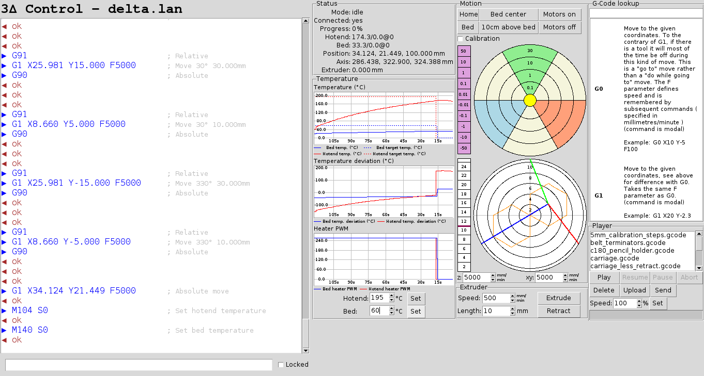

# 3Δ Printer Control

3Δ is a host software for 3d printers of the delta style. In many aspects it is similar to [Pronterface](https://github.com/kliment/Printrun). However
it brings additional motion control better suited to non-cartesian delta printers.

List of features:

* GCode console
* Connection via serial and telnet
* Plots for temperature, temperature deviation and heater PWM
* Relative and absolute motion control especially suited for delta printers
* Calibration assistance for delta printers
* GCode lookup taken from http://smoothieware.org/supported-g-codes
* SD card upload and play
* Send: direct playing of GCode files

This is how it looks:

## Installation

Just download this one file `3delta` and make it executable. Besides that you need the following packages which are available under the usual Linux distributions

~~~
apt-get install tcl8.5 tk8.5 tcllib tklib
~~~

Then start it with

~~~
$ ./3delta 192.168.1.x
$ ./3delta /dev/ttyACM0
~~~

## Disclaimer

In principle 3delta should work also under Mac and Windows when the current Tcl/Tk packages are installed. However I didn't test it.

I am currently using [Smoothieware](https://github.com/Smoothieware/Smoothieware) as firmware. Some features might not work with other firmwares since the output format sometimes differs.
I would also appreciate patches which make this work with other firmwares.
